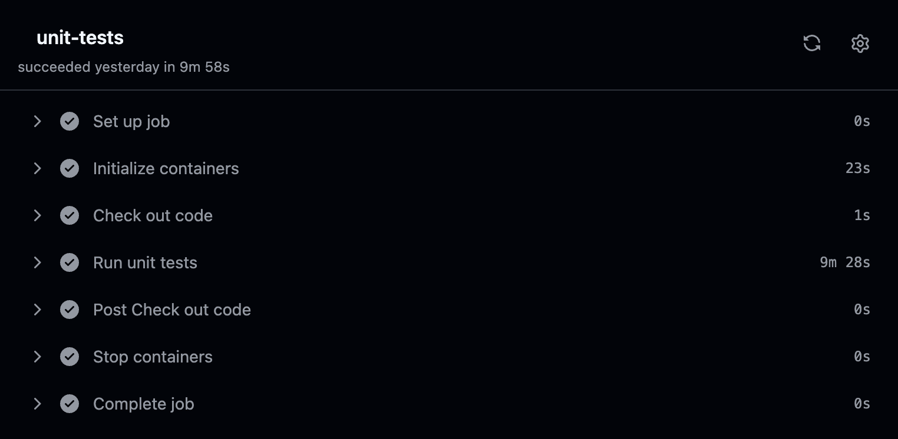
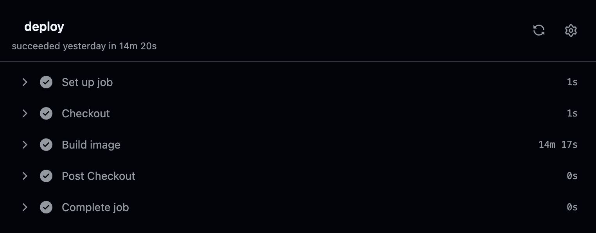
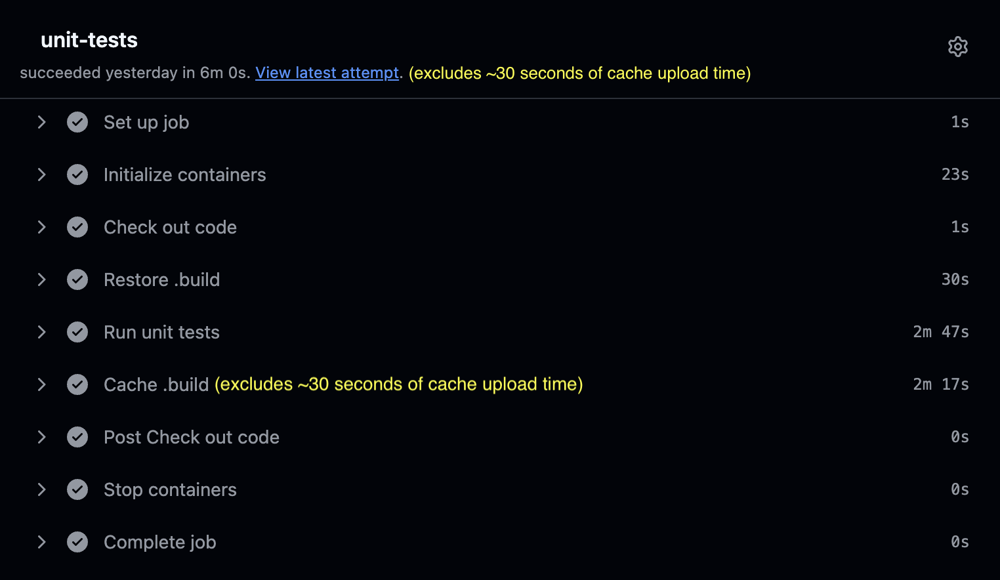
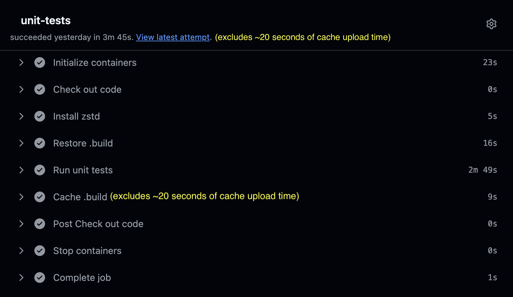
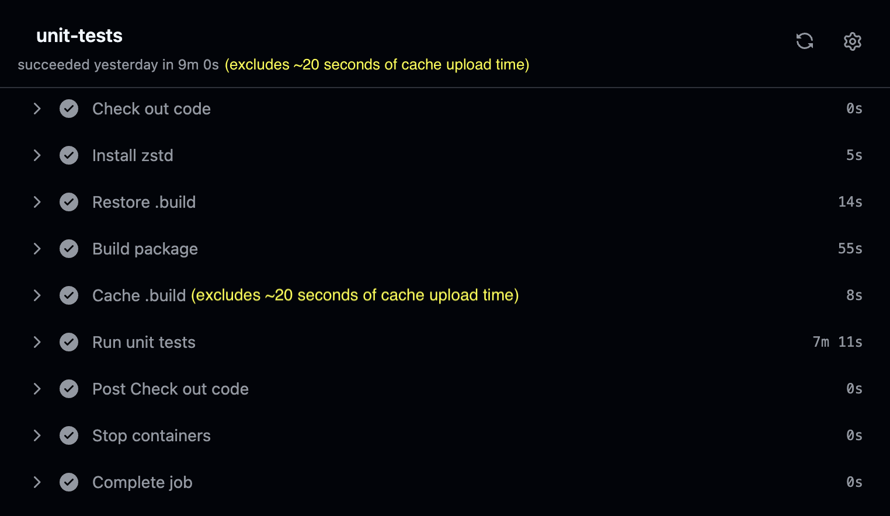
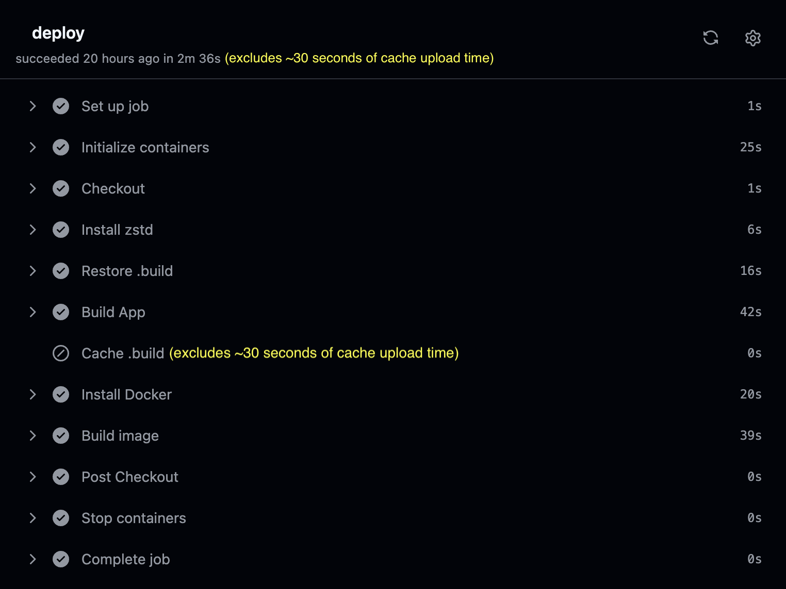
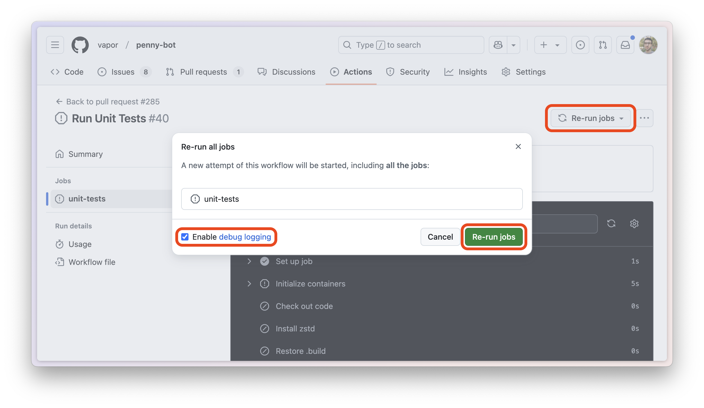
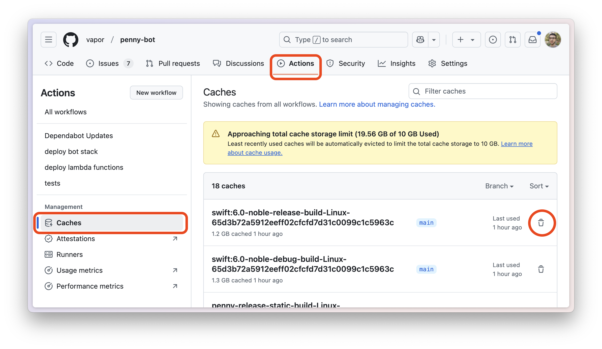

# Faster GitHub Actions CI for Swift Projects

Swift has a lot of power points, but performance of the build system is not one of them. It can easily take anything between 10 to 30 minutes for a typical SwiftPM CI to run depending on how big the project is, what build configuration you're using, how beefy your build machines are, and other factors.

By optimizing your CI runtime you'll save precious developer time as well as either paying less for CI or consuming less of your GitHub Actions free quota.

In this article, you'll walk through optimizing [Vapor's Penny Bot](https://github.com/vapor/penny-bot) CI times to go from 10 minutes in tests and 14.5 minutes in deployments, down to less than 4 minutes in tests, and 3 minutes in deployments. The bigger your project is, the bigger the gap will be.

To follow along, you should clone [Penny](https://github.com/vapor/penny-bot) and checkout the `swift-on-server-article` tag.

```sh
git clone https://github.com/vapor/penny-bot.git
cd penny-bot
git checkout swift-on-server-article
```

## The Problem

In [GitHub Actions](https://docs.github.com/actions), a usual CI file to run tests of a Swift project can look like this:

```yaml
name: tests
on:
  pull_request: { types: [opened, reopened, synchronize, ready_for_review] }
  push: { branches: [main] }

jobs:
  unit-tests:
    runs-on: ubuntu-latest
    container: swift:6.0-noble
    steps:
      - name: Checkout code
        uses: actions/checkout@v4

      - name: Run unit tests
        run: swift test --enable-code-coverage

      # Process the code coverage report, etc...
```

For deployments you'd use a CI file like below in combination with [Vapor](https://github.com/vapor/template/blob/main/Dockerfile) or [Hummingbird](https://github.com/hummingbird-project/template/blob/main/Dockerfile) template's Dockerfile.

This enables you to deploy your apps to cloud services that consume Docker images, such as AWS ECS or DigitalOcean App Platform.

```yaml
name: deploy
on:
  push: { branches: [main] }

jobs:
  deploy:
    runs-on: ubuntu-latest
    steps:
      - name: Checkout code
        uses: actions/checkout@v4

      - name: Build image
        run: docker build --network=host -t app:latest .

      # Push the image to a Docker container registry and deploy the app
```

These CIs usually take 10 minutes in tests and 14.5 minutes for deployments in [Penny](https://github.com/vapor/penny-bot).

That's too much time wasted waiting. How can you improve these CI times?





## Use Caching

Luckily for you, GitHub provides an [official caching action](https://github.com/actions/cache) to leverage in your CI.

SwiftPM stores its build artifacts in the `.build` directory. You should cache that directory so your new CI runs can use the build artifacts of the previous CI runs.

It'll look like this in the tests CI:

```diff
+      - name: Restore .build
+        id: "restore-build"
+        uses: actions/cache/restore@v4
+        with:
+          path: .build
+          key: "swiftpm-tests-build-${{ runner.os }}-${{ github.event.pull_request.base.sha || github.event.after }}"
+          restore-keys: "swiftpm-tests-build-${{ runner.os }}-"

      - name: Run unit tests
        run: swift test --enable-code-coverage

+      - name: Cache .build
+        if: steps.restore-build.outputs.cache-hit != 'true'
+        uses: actions/cache/save@v4
+        with:
+          path: .build
+          key: "swiftpm-tests-build-${{ runner.os }}-${{ github.event.pull_request.base.sha || github.event.after }}"
```

In the "Restore .build" step, you're using:

- The `restore` capability of `actions/cache`, and asking it to restore your existing cache to the `.build` directory.

- The `key` as a way to uniquely identify different caches. This resolves to a string like `swiftpm-tests-build-Linux-f5ded47...`.

- The `restore-keys` as fallback. `actions/cache` will restore the latest cache that starts with any of the `restore-keys`, if it can't find any caches matching `key` .

Note that `actions/cache` follows some branch protection rules so it's not vulnerable to cache poisoning attacks. That means that it'll only restore a cache if it was cached from the current branch or the primary branch of your repository.

After running the tests is over, you have the "Cache .build" step.

That's where you're using the `save` capability of `actions/cache` to save your `.build` directory using the same `key` that you used in "Restore .build".

With the `if` condition, you're avoiding spending time in the cache step when you already found an exact match for the cache key in the "Restore .build" step. This is because `actions/cache` rejects saving cache entries with duplicate keys, and does not have an update mechanism.

This `if` statement will still evaluate to `false` if "Restore .build" had to fallback to `restore-keys` to find a cache.

The `${{ github.event.pull_request.base.sha || github.event.after }}` in the cache `key` will also resolve to the base branch commit SHA of your pull request, or to the current commit SHA if the job run is triggered by a push event and not in a pull request.

This makes sure your pull request will use a cache from the commit the pull request is based on. Push events will also usually fallback to the latest cache that has been uploaded from the branch the CI is running on.

Now let's see. How is your CI doing after adding these 2 steps?

For the first run, don't expect any time improvements as there is simply no cache the action run can use.

But if you re-run the CI job, you'll notice a big difference.

Your tests CI runtime has drop to 6.5 minutes, saving 3.5 minutes.

This is assuming both your restore and cache steps are triggered, which is not always true thanks to the if condition you have in "Cache .build". But in a lot of CIs you'll still be restoring and uploading caches in the same CI run. For example every single time you push changes to your primary branch.



You've already saved at least 3.5 minutes of CI runtime, and that's great. But let's look closer.

What's consuming the CI runtime now that you're using caching? Is it really taking 6.5 minutes for the tests to run even after all your efforts?

The answer is No. If you look at the "Restore .build" step, you'll notice it's taking around 30 seconds to restore the data. Likewise, "Cache .build" step of the first run of your CI is taking more than 2.5 minutes caching around 1.5 GB worth of `.build` data.

Wouldn't it be so nice if you could decrease the times spent caching? After all, only 3 minutes of your CI runtime is related to your tests step.

## Speed Up Caching With zstd

As it turns out, `actions/cache` compresses directories before uploading them to GitHub. This compression process uses [`gzip`](https://github.com/Distrotech/gzip) by default. Considering [`gzip`](https://github.com/Distrotech/gzip) runs on a single CPU core, it can easily take 2.5 minutes to compress and upload a 1.5 GB `.build` directory. This way, almost half your CI time is wasted in the cache-related operations.

The hope is not lost, though. The good news is that `actions/cache` detects if [`zstd`](https://github.com/facebook/zstd) is available on the machine, and if so, it'll use that instead of [`gzip`](https://github.com/Distrotech/gzip).

[`zstd`](https://github.com/facebook/zstd) is a modern alternative to the [`gzip`](https://github.com/Distrotech/gzip) compression algorithm. It's not only much faster, but is also more effective at decreasing the file size during compression.

Even [`gzip`](https://github.com/Distrotech/gzip)'s parallel implementation known as [`pigz`](https://github.com/madler/pigz) is noticeably slower than [`zstd`](https://github.com/facebook/zstd) in this case.

Simply install [`zstd`](https://github.com/facebook/zstd) on the machine before any calls to `actions/cache`. This way `actions/cache` can detect and use [`zstd`](https://github.com/facebook/zstd):

```diff
+      - name: Install zstd
+        run: |
+          apt-get update -y
+          apt-get install -y zstd

      - name: Restore .build
        id: "restore-build"
        uses: actions/cache/restore@v4
        with:
          path: .build
          key: "swiftpm-tests-build-${{ runner.os }}-${{ github.event.pull_request.base.sha || github.event.after }}"
          restore-keys: "swiftpm-tests-build-${{ runner.os }}-"

      - name: Run unit tests
        run: swift test --enable-code-coverage
```

Run the tests CI twice, so the second run can leverage the [`zstd`](https://github.com/facebook/zstd) cache and give you an accurate idea.



Take another look at your CI times. The whole CI is running in **4 minutes**, down from 6.5 minutes.

This is thanks to "Restore .build" only taking half the previous time at **15 seconds**. "Cache .build" is also taking less than **30 seconds**, down from the previous 2.5 minutes.

This 4 minutes of CI runtime includes **100 seconds** of tests runtime as well! If your tests take less time than that, your CI will be even faster.

## Decouple Build and Tests-Run

A logical problem in your current tests CI file is that if the tests fail, GitHub Actions will end the run and the "Cache .build" step won't be triggered.

This will be an annoyance in new pull requests, specially if they're big. Your CI will need to rebuild a large portion of the project, which might substantially increase the CI time, up to the original 10 minutes of CI time you had. But when the tests result in a failure, the cache step will be skipped. Then in the next run the CI will need to rebuild the whole changes of your pull request, all over again.

You can fix this issue by separating the build from the test-run.

It's simple. Build the app first, run the tests later after you're done caching the build artifacts:

```diff
      - name: Restore .build
        id: "restore-build"
        uses: actions/cache/restore@v4
        with:
          path: .build
          key: "swiftpm-tests-build-${{ runner.os }}-${{ github.event.pull_request.base.sha || github.event.after }}"
          restore-keys: "swiftpm-tests-build-${{ runner.os }}-"

-      - name: Run unit tests
-        run: swift test --enable-code-coverage
+      - name: Build package
+        run: swift build

      - name: Cache .build
        if: steps.restore-build.outputs.cache-hit != 'true'
        uses: actions/cache/save@v4
        with:
          path: .build
          key: "swiftpm-tests-build-${{ runner.os }}-${{ github.event.pull_request.base.sha || github.event.after }}"

+      - name: Run unit tests
+        run: swift test --enable-code-coverage
```

Looks good, right?

Run the tests CI twice to make sure the cache is updated for the second run.



You'll notice a big regression. Even when cache is available, the CI runtime has gone back up to around 9 minutes 15 seconds.

Looking at runtimes of each step, you can see that "Build package" is only taking 1 minute when a cache is available. "Run unit tests" on the other hand is taking a whopping 7 minutes to run. It's as if the "Run unit tests" step is re-building majority of the project again, ignoring the fact that you already built the package in an earlier step.

How can you overcome this issue?

## Optimize Build Steps For Maximum Speed

There are a few tricks you haven't utilized yet.

Change your "Build package" and "Run unit tests" steps to the following:

```yaml
      - name: Build package
-        run: swift build
+        run: swift build --build-tests --enable-code-coverage

      - name: Cache .build
        if: steps.restore-build.outputs.cache-hit != 'true'
        uses: actions/cache/save@v4
        with:
          path: .build
          key: "swiftpm-tests-build-${{ runner.os }}-${{ github.event.pull_request.base.sha || github.event.after }}"

      - name: Run unit tests
-        run: swift test --enable-code-coverage
+        run: swift test --skip-build --enable-code-coverage
```

Rerun the job once again after the cache is updated.


Great! The CI runtime is down to **4 minutes 20 seconds**!

You're almost back to the 4-minutes CI runtime mark. This means you're only paying around 20 seconds of penalty to make sure the CI steps are more logical. This way you account for unit tests failure in a better manner.

But how did you cut so much of the run time?

Thanks to the `--build-tests` flag, you're building the test targets as well in the updated CI file. By using `--enable-code-coverage` in the build step, you're also caching a part of the code coverage work that "Run unit tests" would need to do. You still need to use `--enable-code-coverage` when running your unit-tests since you want to make sure Swift gathers code coverage in runtime of your unit-tests as well.

Finally you use `--skip-build` when running unit tests because you know you've already built the whole project.

## Testing in Parallel

[Penny](https://github.com/vapor/penny-bot)'s tests currently take 100 seconds to run as mentioned before, which is another factor raising the CI time.
This is because [Penny](https://github.com/vapor/penny-bot) runs its tests one by one which means only 1 test can be running at a time.

A significant optimization can be to run the tests in parallel. While parallel-testing is the default behavior in [swift-testing](https://github.com/swiftlang/swift-testing), you need to use the `--parallel` flag if your tests use [`XCTest`](https://developer.apple.com/documentation/xctest):

```diff
      - name: Run unit tests
-        run: swift test --skip-build --enable-code-coverage
+        run: swift test --skip-build --enable-code-coverage --parallel
```

Be warned though! If your tests use shared resources during testing, it's likely that they will start failing with parallel-testing.

Enabling parallel-testing is highly encouraged, but usually takes time, effort and modifications in your testing infrastructure. For that reason, this article will continue assuming you haven't enabled parallel-testing.

For comparison, in a future version of [Penny](https://github.com/vapor/penny-bot), we moved the tests to be run in parallel. [Penny](https://github.com/vapor/penny-bot)'s tests now only take **5 seconds** to run compared to the previous 100 seconds. That saves more than 1.5 minutes of CI time. Note that the time savings will vary depending on the project, and can be less, or much more.

## Cache Build Artifacts When Using A Dockerfile

Your tests CI is pretty fast now and only takes around 4 minutes.

But what about your deployments?

While there are a lot of similarities in implementation of caching in tests CI and deployment CI, there are still some differences.

The project build in the deployment CI usually happens in a Dockerfile. While people have found ways around this, it's still not easy to use `actions/cache` for files and folders that are in a Dockerfile.

You need to pull out the build step out of the Dockerfile and move it to the deployment CI file to make your Dockerfile cache-friendly.

Simplify your Dockerfile like so. The code-diff below is based on [Vapor template's Dockerfile](https://github.com/vapor/template/blob/main/Dockerfile), which is also what [Hummingbird's](https://github.com/hummingbird-project/template/blob/main/Dockerfile) is based on.

```diff
# Set up a build area
WORKDIR /build

-# First just resolve dependencies.
-# This creates a cached layer that can be reused
-# as long as your Package.swift/Package.resolved
-# files do not change.
-COPY ./Package.* ./
-RUN swift package resolve \
-        $([ -f ./Package.resolved ] && echo "--force-resolved-versions" || true)

# Copy entire repo into container
COPY . .

-# Build the application, with optimizations, with static linking, and using jemalloc
-# N.B.: The static version of jemalloc is incompatible with the static Swift runtime.
-RUN swift build -c release \
-        --product App \
-        --static-swift-stdlib \
-        -Xlinker -ljemalloc
```

You'll no longer build your app in the Dockerfile. You copy the whole repository to the Dockerfile like before but unlike before you expect the repository to already contain the build artifacts and the executable.

Let's not let down your Dockerfile! You need to modify the CI deployment file to not only build the project, but also to use caching like you've learned before:

```diff
name: deploy
on:
  push: { branches: [main] }

jobs:
  deploy:
    runs-on: ubuntu-latest
+    container: swift:6.0-noble
    steps:
      - name: Checkout code
        uses: actions/checkout@v4

+      - name: Install curl and zstd
+        run: |
+          apt-get update -y
+          apt-get install -y curl zstd
+
+      - name: Restore .build
+        id: "restore-build"
+        uses: actions/cache/restore@v4
+        with:
+          path: .build
+          key: "swiftpm-deploy-build-${{ runner.os }}-${{ github.event.pull_request.base.sha || github.event.after }}"
+          restore-keys: "swiftpm-deploy-build-${{ runner.os }}-"
+
+      - name: Build App
+        run: |
+          apt-get update -y
+          apt-get install -y libjemalloc-dev
+
+          # Build the application, with optimizations, with static linking, and using jemalloc
+          swift build \
+            -c release \
+            --product App \
+            --static-swift-stdlib \
+            -Xlinker -ljemalloc \
+            $([ -f ./Package.resolved ] && echo "--force-resolved-versions" || true)
+
+      - name: Cache .build
+        if: steps.restore-build.outputs.cache-hit != 'true'
+        uses: actions/cache/save@v4
+        with:
+          path: .build
+          key: "swiftpm-deploy-build-${{ runner.os }}-${{ github.event.pull_request.base.sha || github.event.after }}"
+
+      - name: Install Docker
+        run: curl -fsSL https://get.docker.com | bash

      - name: Build image
        run: docker build --network=host -t app:latest .
```

Make sure you substitute `App` in the CI file above if you've changed your main executable's name from the default `App` to something else.

Most of the new steps look familiar to you. You've already used them to speed up your tests CI.

On top of those caching steps, you also need to make sure to:

- Instruct GitHub Actions to run the CI file in a `swift:6.0-noble` container, instead of `ubuntu-latest`.

- Install `curl` which will later be used in the Docker installation step.

- Slightly modify the caching key to make sure your deployments don't go using your tests' caches! You've modified `swiftpm-tests-build` to `swiftpm-deploy-build` in the cache keys above, and that's enough.

- Manually install Docker since Swift images don't contain Docker.

The "Build App" step is mostly a copy of what was in the Dockerfile. The step installs jemalloac to be able to use it in the app compilation and in the last line of the step, it makes sure to respect your current `Package.resolved` file instead of randomly updating your packages.

Rerun the deployment CI twice to make sure the cache is populated.



It's now taking a mere **3 minutes** for the deployment CI to finish, down from 14.5 minutes!

## Using Self-Hosted GitHub Actions Runners With RunsOn

Sometimes your project is too big and the GitHub Actions runner runs out of memory. Or maybe you just want better CI times.

The easiest way to solve these problems is to upgrade your runner with more CPU cores and more RAM.

GitHub provides you with 2 options: Paid GitHub-hosted runners or self-hosted runners.

That's when [RunsOn](https://runs-on.com/) comes in. You should use RunsOn runners as your self-hosted runners, because:

- It's around [10x cheaper](https://runs-on.com/pricing/) than the paid GitHub-hosted runners.

- Installation and moving your GitHub Actions infrastructure to RunsOn is easy.

- You can use any [AWS EC2 instance](https://aws.amazon.com/ec2/instance-types/) that you want.

- EC2 instances with the same specs of GitHub-hosted runners are not only cheaper, but faster too.

- RunsOn lives in your own AWS account: Your code and secrets never leave your infrastructure.

While this is a sponsored section with the earnings going towards the Swift open-source ecosystem, it's also an accurate advertisement with no exaggerations.

I - the article author - was using RunsOn long before the writing of this article. I simply found this article to be a great opportunity to spread the word in a collaboration.

At Vapor we're also using EC2 instances through RunsOn to run benchmarks. EC2 instances are much more reliable for CPU benchmarks than the noisy GitHub-hosted runners.

To give you an idea of how much RunsOn costs, I ran 96 jobs when trying to set up Vapor's benchmarking CI. It cost less than $0.5 on the latest-generation c8g EC2 spot instances with 2 CPU cores and 4 GB of RAM, each run taking around 2.5 minutes. That's excluding the $1.5-$5 monthly cost of RunsOn's AppRunner service, and the possible [RunsOn license flat-fee](https://runs-on.lemonsqueezy.com/?aff=ngLyB) that you might need to pay.

Now you know RunsOn. After installing RunsOn, moving your CI files to RunsOn is trivial:

```diff
jobs:
  unit-tests:
-    runs-on: ubuntu-latest
+    runs-on: runs-on=${{ github.run_id }}/runner=2cpu-linux-x64/extras=s3-cache
    container: swift:6.0-noble
    steps:
+      - name: Configure RunsOn
+        uses: runs-on/action@v1

    # Other steps ...
```

The first change you'll make is to modify the machine instance to a RunsOn EC2 instance. You should also enable [RunsOn's Magic Cache](https://runs-on.com/caching/magic-cache/) feature with `extras=s3-cache`.

After that you'll need to add the RunsOn configuration step as the first step of your CI file to install the Magic Cache. This way RunsOn saves your caches to a S3 bucket. Using S3 buckets is cheap. They're also faster than GitHub Actions' cache, and have no size limits as opposed to GitHub Actions' 10GB limit.

Don't forget to modify your tests CI file to be RunsOn-compatible too.

And that's it. Using RunsOn is that simple.

Swift on Server has partnered with RunsOn, which means if you register via this [affiliate link](https://runs-on.lemonsqueezy.com/?aff=ngLyB), we’ll receive 20% of the subscription fee. We’re committed to use the earnings towards supporting Swift open-source projects and communities.

## When Things Go Wrong

Sometimes some inconsistency in the cached .build directory and what Swift expects, will result in build failures.

This usually manifests as weird build failures such as linker errors like 'undefined reference to ...'. Other times there are no helpful error logs, or the error logs point to something that should no longer exist.

Thankfully this won't be frequent and theoretically shouldn't happen at all. It's also easy to work around.

To account for this issue, you have 3 options. Doing any one of them will suffice:

1- Using `runner.debug != '1'` in an `if` condition so debug reruns of the same job don't try to restore any caches at all, and result in a clean build.

This mean you'll be able to use the "Re-run jobs" button in the GitHub Actions UI, check the "Enable debug logging" box, and have a clean build.

```diff
      - name: Restore .build
+        if: ${{ runner.debug != '1' }}
        id: "restore-build"
        uses: actions/cache/restore@v4
        with:
          path: .build
          key: "swiftpm-tests-build-${{ runner.os }}-${{ github.event.pull_request.base.sha || github.event.after }}"
          restore-keys: "swiftpm-tests-build-${{ runner.os }}-"
```



2- Using [this](https://github.com/actions/cache/blob/main/tips-and-workarounds.md#force-deletion-of-caches-overriding-default-cache-eviction-policy) workflow to delete all saved caches, so `Restore .build` step doesn't find anything to restore, and your build starts from a clean state.

3- Manually delete the relevant caches through GitHub Actions UI:


