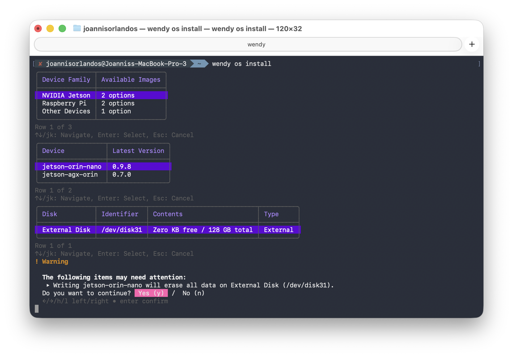
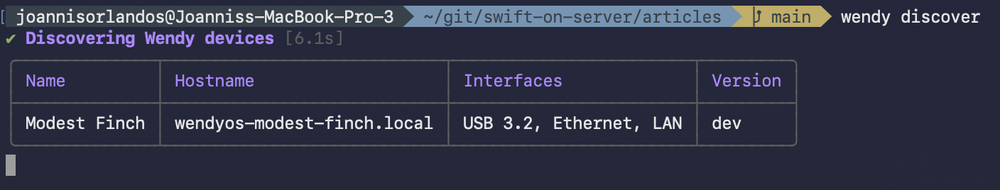
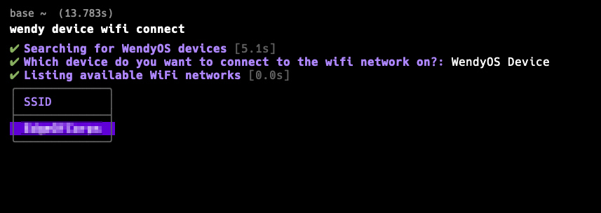
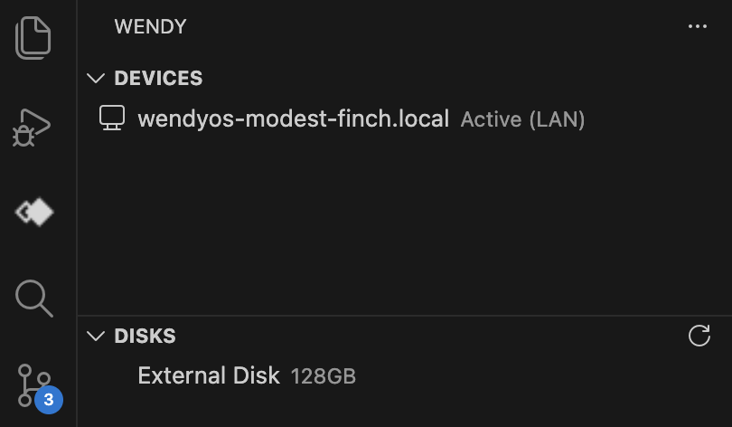
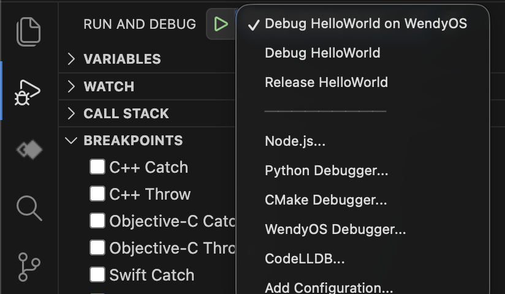

# Setting up Embedded Linux with WendyOS

Those who have worked with Embedded devices, whether Microcontroller or Single Board Computers, will know that setting up a development environment is not easy.

While the hardware is relatively simple to setup, the software is not. You need to install the correct drivers, libraries, and tools to get the device to work. 

The most common way to develop for Embedded devices is to use a Linux distribution. However, those unfamiliar with the ecosystem are often overwhelemed by the amount of choices and decisions to make.

In contrast, developing with Swift on iOS is very easy. Creating a new project is a few clicks away, and uploading to the device is a simple matter of plugging it in and running the app. Remote debugging and instrumentation come for free.

## Prerequisites

- Wendy supports development on macOS, Linux and Windows.
- You need to have a WendyOS supported device. You can check the list of compatible devices [here](https://wendy.sh/docs/installation/developer-machine-setup/#system-compatibility).
- You'll need an SD card or NVME drive (depending on your device) to install the WendyOS onto.

If using an NVME drive, you'll need an adapter to USB so you can connect it to your computer. Check the [Buyers Guide](https://wendy.sh/docs/buyers-guide/) if unsure.

## WendyOS

[WendyOS](https://wendy.sh) is a Linux distribution specifically designed for Embedded devices. It's an Open Source project written with Swift that helps you rapidly start building and iterating your next Embedded project.

Before we can start developing with Swift on WendyOS, we need to set up the development tools.

### Installing the Wendy Tools

Wendy apps are built and run using the `wendy` command. This command helps you install your OS, connect it to WiFi, run, manage and debug apps, and much more.

Before installing the `wendy` command, you need to install Homebrew. You can do this by following the instructions on the [Homebrew website](https://brew.sh), or by running the following command:

```sh
/bin/bash -c "$(curl -fsSL https://raw.githubusercontent.com/Homebrew/install/HEAD/install.sh)"
```

We provide a Linux binary as well as a Windows MSI installer in our latest releases on Github. You can download the latest release [here](https://github.com/wendylabsinc/wendy-agent/releases/latest).

Once you have Homebrew installed, you can install the `wendy` command using the following command:

```sh
brew install wendylabsinc/wendy
```

### Installing the WendyOS

To install the WendyOS, first connect your SD card or NVME drive to your computer.

<video src="pi-5-insert-card-into-macbook.mp4" autoplay loop muted></video>

Then, run the following command:

```sh
wendy os install
```



1. Select your brand and model of device from the list.
2. Select the SD card or NVME drive you want to install the WendyOS onto.
3. Confirm your selection, and the installation will begin.

This will download the latest WendyOS image, and install it onto your SD card or NVME drive.
Once ready, plug the disk into your device and boot it up.

## Connecting to your device

By default, WendyOS devices don't know what WiFi network to connect to. However, you can connect to your device via USB to get started!

<video src="pi-5-usb-c-to-macbook.mp4" autoplay loop muted></video>

More powerful devices like the Jetson Orin Nano will require both USB for data and a separate power supply.

<video src="jetson-power-cable-insertion.mp4" autoplay loop muted></video>

Let's check if the device is connected to your computer!

```sh
wendy discover
```



Congrats, your Wendy device is now ready to use!

### Selecting a Default Device

By default, the `wendy` command will use the first device it finds. However, it'll still wait 5 seconds for devices to be discovered. If you have multiple devices, you can select a default device to use.

Many developers will only start out with one device, so you can set a default device to use.

```sh
wendy device set-default
```

### Connecting to WiFi

Many apps require your device to be connected to the internet. You can connect to WiFi using the CLI, or connect it over Ethernet. Let's connect to WiFi.

```sh
wendy wifi connect
```



1. Select your WiFi network from the list.
2. Enter your WiFi password.
3. Confirm your selection, and the connection will begin.

This will connect to your WiFi network. You can now connect over LAN, as well as USB. Wendy CLI will automatically the detect available network paths and choose one for you.


## Creating a new Wendy App

Most Wendy apps are written in Swift. You can create a new Swift app using the `wendy` command.

```sh
mkdir my-app
cd my-app
wendy init
```

This will set up a fresh SwiftPM package for you with one extra file: `wendy.json`

`wendy.json` describes your app's programming language, which is used for remote debugging. This is predefined to `swift` for you.

In addition, it specifies a list of entitlement that your app requires. These include;
- Network Access
- Bluetooth
- GPU
- Webcam Access
- Audio Capture/Playback
- And more!

The full list can be found [here](https://wendy.sh/docs/guides/device/entitlements/). You can add missing entitlements using the CLI:

```sh
wendy project entitlement add
```

This will provide you with a selection menu to add the required entitlements.

To run your app, simply execute the following command:

```sh
wendy run
```

This will build your app and run it on your device! You should see your app cross-compile and run on your device in real-time!

## VSCode Support

Many Swift Developers love editors like VSCode. WendyOS also provides a VSCode extension to help you remotely debug your app.

### Installing the VSCode Extension

You can install the VSCode extension from the [Marketplace](https://marketplace.visualstudio.com/items?itemName=wendylabsinc.wendy-vscode).

From there, you'll see a new section in your sidebar called "Wendy".
Here, your local devices will automatically be discovered and listed. Including any external devices you may want to flash the OS onto.



If your OS is already flashed to disk, it'll show up in the list. Select your device in the list, then go to the "Run and Debug" section in VSCode.
Next to the "Run" button (play icon), you'll see your App's name. Ensure it's set to "Debug <app> on WendyOS".



Click on the "Run" button to start debugging your app. You should see your app compile and run on your device!
Any breakpoints you set will be hit, and you can inspect the state of your app.

## Conclusion

You're now ready to start building your next Embedded project with Swift on WendyOS! There are a variety of pre-built projects available: [https://github.com/wendylabsinc/samples](https://github.com/wendylabsinc/samples).

1. Clone the repository
2. Open a project in the Terminal or VSCode
3. Run the app!
